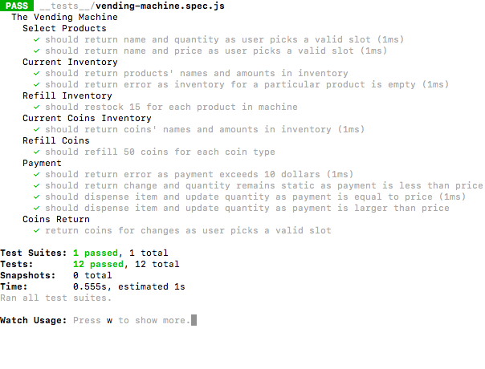

# Vending Machine

Vending Machine is a UI-less Javascript Application that describe and test for vending machine functionalities. The machine stores a variety of products, dispenses items and return coins depend on user input.

## Authors

Tim Nguyen | https://github.com/timng93

## Screenshots

### Tests

## Technologies Used

- Jest Library

## Installation Instructions

`npm test`
